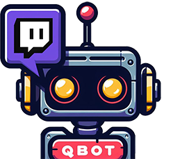
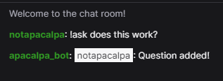
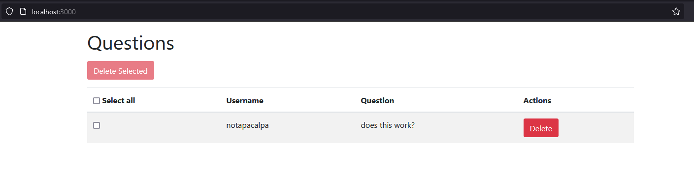

#  QBot 


QBot is a Twitch chat bot and web application designed to facilitate viewer interaction during live streams. It allows viewers to ask questions, which are then stored in a database for the streamer to answer at their convenience.

This project is a POC (Proof of Concept).

 
## How the Bot Works
QBot is a Twitch chat bot designed to enhance viewer interaction during live streams. It provides the following functionality:

- Question Submission: Viewers can submit questions during the live stream using the `!ask` command followed by their question. For example: `!ask What's your favorite game?`

- Question Storage: When a viewer submits a question, the bot stores it in a MySQL database along with the username of the viewer who asked the question and the channel where the question was submitted.

- Question Retrieval: The streamer can retrieve the submitted questions through a web interface provided by the QBot web server. They can log in with their Twitch account and view all questions submitted by viewers during the stream.

- Web Interface: The QBot web interface displays a list of submitted questions, including the username of the viewer who asked each question. The streamer can easily browse through the questions, select specific questions to answer, and mark questions as answered.


## Example Usage
### Viewer Interaction:

Viewer: !ask What's your favorite game?
Bot (in Twitch chat): @username: Question added!
### Streamer Interaction:
The streamer logs in to the QBot web interface using their Twitch account.
They can see a list of questions submitted by viewers, along with the usernames of the viewers who asked each question.
The streamer can select specific questions to answer, mark questions as answered, or delete irrelevant questions.
Benefits
Enhanced Viewer Engagement: QBot encourages viewer participation by allowing them to ask questions and interact with the streamer directly.
Streamline Question Management: The web interface makes it easy for the streamer to manage and prioritize questions submitted by viewers.
Convenient Integration: The bot seamlessly integrates with the Twitch chat and provides a user-friendly web interface for streamers to interact with.
By leveraging QBot, streamers can create a more interactive and engaging experience for their viewers, fostering a sense of community and connection during live streams.


## How the Bot Works (for the devs)

QBot is implemented as a Twitch chat bot using Python and the `irc.bot` module. Here's an overview of how the bot works:

1. **Initialization**: The bot is initialized with the Twitch username of the bot owner, the Twitch OAuth token, and the channel where the bot will operate.

2. **Connection to Twitch IRC**: The bot connects to the Twitch IRC server (`irc.chat.twitch.tv`) using the provided OAuth token. It joins the specified channel and listens for messages from viewers.

3. **Message Processing**: When a message is received in the channel, the bot's `on_pubmsg` method is invoked. It checks if the message starts with the `!ask` command and processes it by adding the question to the database.

4. **Database Interaction**: The bot interacts with a MySQL database to store questions submitted by viewers. It uses the `mysql.connector` module to establish a connection to the database and execute SQL queries.

5. **Logging**: The bot logs events, such as joining the channel and adding questions, using the Python `logging` module.

## Installation

1. Clone the repository:

    ```bash
    git clone https://github.com/your_username/QBot.git
    cd QBot
    ```

2. Install Node.js dependencies:

    ```bash
    npm install
    ```

3. Install Python dependencies:

    ```bash
    pip install -r requirements.txt
    ```

4. Configure MySQL database:
   
   - Open `bot.py` file.
   - Update the MySQL connection details in the `__init__` method of the `TwitchBot` class.

5. Configure Twitch OAuth:

    - Open `bot.py` file.
    - Replace `username`, `token`, and `channel` with your Twitch bot's credentials.

6. Configure MySQL database:

   - Open server.js file.
   - Update the MySQL connection details in the db object.

7. Configure Twitch OAuth:

   - Open server.js file.
   - Replace clientID, clientSecret, callbackURL, and scope with your Twitch OAuth credentials.

8. Set session secret:

   - Open server.js file.
   - Replace '' with a secure session secret.

## Usage

1. Start the bot:

    ```bash
    python bot.py
    ```
2. Start the server:
    
    ```bash
    node app.js
    ```

3. Navigate to `http://localhost:3000` in your web browser.
4. Log in with your Twitch account.
5. Start your Twitch stream and interact with viewers.
6. View and manage questions submitted by viewers through the web interface.

## Contributing

Contributions are welcome! Feel free to open issues or pull requests for bug fixes, enhancements, or new features.

## License

This project is licensed under the [MIT License](LICENSE).
